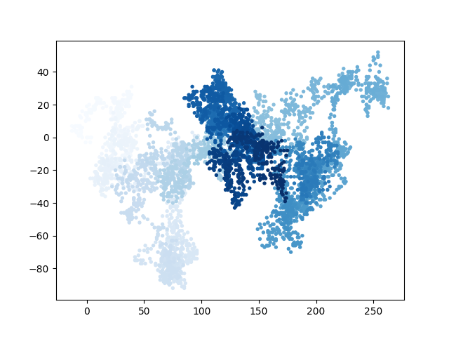
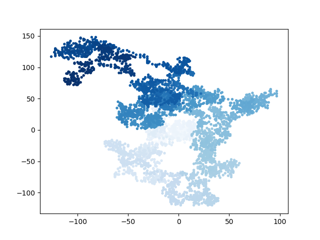
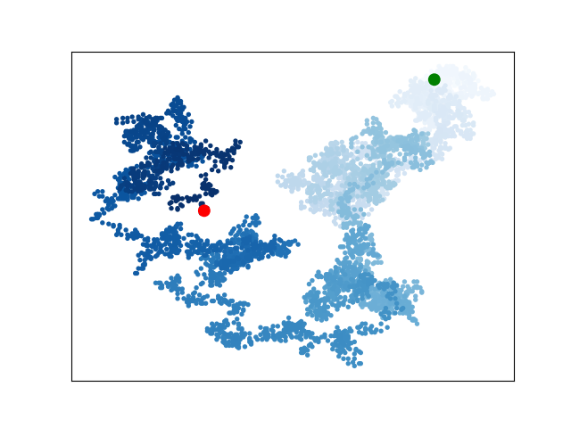

# Data Visualization
数据可视化。

# ENV
- Python 3.9.1
- PyCharm 2022.2.2
- MacOS

# Running
```shell
# 依赖
$ cd data_visual
$ pip3 install -r requirements.txt
```

# 示例
## mpl Square


## Scatter


## Random Walk







## Die Visual


## Different Visual


## Daily high temperatures


